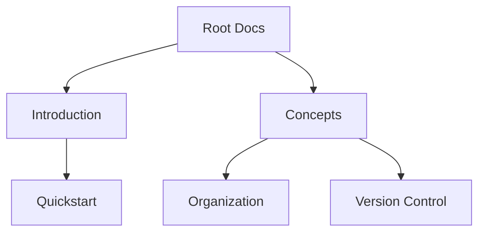

## Overview

You manage documentation effectively by grasping core concepts like hierarchy, organization, version control, and collaboration. These elements form the foundation of Дмитрий Денисов's documentation space. Start with a clear structure to scale your projects seamlessly.

<Callout kind="info">
  Master these concepts to organize projects efficiently and collaborate without friction.
</Callout>

## Documentation Hierarchy and Pages

Documentation follows a tree-like hierarchy: root pages branch into subpages, enabling logical navigation. Use frontmatter for metadata, H2 headings for sections, and components for rich content.



This structure keeps content discoverable. Link pages with relative paths like `/concepts/organization`.

<Columns cols={3}>
  <Card title="Pages" icon="file-text">
    Individual MDX files with frontmatter.
  </Card>
  <Card title="Hierarchy" icon="layers">
    Nested navigation via folders.
  </Card>
  <Card title="Components" icon="puzzle">
    Reusable elements like `<Callout>`.
  </Card>
</Columns>

## Project Organization Strategies

Organize projects by type, team, or feature. Choose strategies based on scale.

<Tabs>
  <Tab title="By Feature" icon="grid">
    Group docs by functionality.
    
    ```
    docs/
    ├── authentication/
    │   ├── setup.mdx
    │   └── flows.mdx
    └── dashboard/
        ├── metrics.mdx
        └── alerts.mdx
    ```
    
    Ideal for modular projects.
  </Tab>
  <Tab title="By Team" icon="users">
    Align with team ownership.
    
    ```
    docs/
    ├── frontend/
    │   └── components.mdx
    └── backend/
        └── apis.mdx
    ```
    
    Enhances accountability.
  </Tab>
  <Tab title="By Version" icon="git-branch">
    Maintain version-specific docs.
    
    ```
    docs/
    ├── v1/
    │   └── api.mdx
    └── v2/
        └── migration.mdx
    ```
  </Tab>
</Tabs>

## Version Control Basics

Integrate Git for tracking changes. Follow these steps to set up version control.

<Steps>
  <Step title="Initialize Repository" icon="git-branch">
    Create a Git repo for your docs.
    
    ````bash
    git init
    git add .
    git commit -m "Initial docs commit"
    ````
  </Step>
  <Step title="Branch for Features" icon="git-pull-request">
    Use branches for changes.
    
    ````bash
    git checkout -b feature/new-page
    git add new-page.mdx
    git commit -m "Add concepts page"
    git push origin feature/new-page
    ````
  </Step>
  <Step title="Merge with Pull Requests" icon="git-merge">
    Review and merge via PRs.
  </Step>
</Steps>

<CodeGroup tabs="Git CLI,GitHub">
  ```bash
  git pull origin main
  git push origin main
  ```
  ```bash
  gh pr create --title "Update concepts" --body "Core changes"
  gh pr merge
  ```
</CodeGroup>

## Collaboration Workflows

Collaborate by assigning reviewers and using approvals. Set up workflows for smooth contributions.

<Expandable title="Advanced Workflow Configuration" default-open="false">
  Configure branch protection rules requiring reviews.
  
  | Rule | Description | Required Reviews |
  |------|-------------|------------------|
  | Main | Protects production | 2 |
  | Develop | Feature integration | 1 |
  | Feature/* | Draft branches | 0 |
</Expandable>

<Callout kind="tip">
  Always reference issues in commits, like `Fixes #123`, to link changes automatically.
</Callout>

Apply these concepts to build scalable documentation in Дмитрий Денисов. Next, explore [quickstart](/quickstart) for hands-on setup.