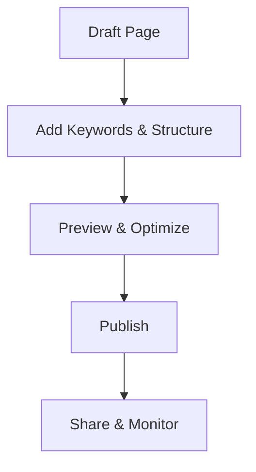

## Overview

Manage your documentation effectively by creating structured pages, incorporating rich media, and optimizing for discoverability. This guide walks you through the essential workflows to build and maintain high-quality docs for your projects in the Дмитрий Денисов space.

<Callout kind="info">
  Start with a clear outline before creating pages to ensure consistent structure across your documentation.
</Callout>

## Creating and Formatting Pages

Create new pages directly from the sidebar or use keyboard shortcuts. Format content using Markdown with MDX extensions for interactive elements.

<Steps>
  <Step title="Create a Page" icon="file-plus">
    Navigate to the sidebar and select "New Page". Enter a title like "API Reference".
  </Step>
  <Step title="Add Structure" icon="heading">
    Use H2 (`##`) for main sections and H3 (`###`) for subsections. Always start body content with H2.
  </Step>
  <Step title="Insert Components" icon="components">
````jsx
<Card title="Quick Start" icon="zap" href="/quickstart">
  Get started in minutes.
</Card>
````
  </Step>
  <Step title="Preview and Save" icon="save">
    Toggle preview mode and save changes. Use version history to revert if needed.
  </Step>
</Steps>

<CodeGroup tabs="Markdown,MDX">
```markdown
## Example Section

- List item 1
- List item 2

| Feature | Benefit |
|---------|---------|
| Fast    | `<1s` load |
```
```jsx
## Interactive Example

<Callout kind="tip">
  Use `{backticks}` for variables like `API_KEY`.
</Callout>
```
</CodeGroup>

## Adding Multimedia and Links

Enhance pages with images, videos, and links. Embed multimedia using dedicated components for optimal rendering.

<Tabs>
  <Tab title="Images" icon="image">
    Upload assets to your space or use external URLs.

````jsx
<Image
  src="https://example.com/screenshot.png"
  alt="Dashboard overview"
  width="800"
  height="400"
/>
````
  </Tab>
  <Tab title="Videos" icon="video">
    Embed platform videos seamlessly.

````jsx
<Video
  src="https://www.youtube.com/embed/dQw4w9WgXcQ"
  title="Tutorial video"
  width="560"
  height="315"
/>
````
  </Tab>
  <Tab title="Links" icon="link">
    Use relative paths for internal docs and full URLs externally.

    - Internal: `[Quickstart](/quickstart)`
    - External: `[GitHub](https://github.com)`
  </Tab>
</Tabs>

## Publishing and Sharing Docs

Publish changes instantly. Share via public links or embed in other sites.

<Columns cols={3}>
  <Card title="Publish" icon="globe" href="#">
    Click "Publish" to make live. Changes reflect immediately.
  </Card>
  <Card title="Share Links" icon="share-2" href="#">
    Generate shareable URLs with optional password protection.
  </Card>
  <Card title="Embed" icon="code" href="#">
    Copy embed code for iframes.

````html
<iframe src="https://docs.example.com/guide" width="100%" height="600"></iframe>
````
  </Card>
</Columns>

<Expandable title="Advanced Publishing Options" default-open="false">
  Set custom domains or integrate with CI/CD pipelines for automated deploys from your repo.
</Expandable>

## Search and Navigation Optimization

Optimize for better discoverability. Use structured headings, keywords, and navigation aids.

| Optimization | Technique | Example |
|--------------|-----------|---------|
| Headings     | H2-H4 hierarchy | `## Core Features` |
| Keywords     | Front-load in titles/descriptions | Title: "API Authentication Guide" |
| Navigation   | Sidebar links, Cards | `<Card href="/guide#section">` |
| Search       | Descriptive alt text, summaries | `alt="User dashboard screenshot"` |



<Callout kind="tip">
  Regularly review analytics to refine high-traffic pages for maximum impact.
</Callout>